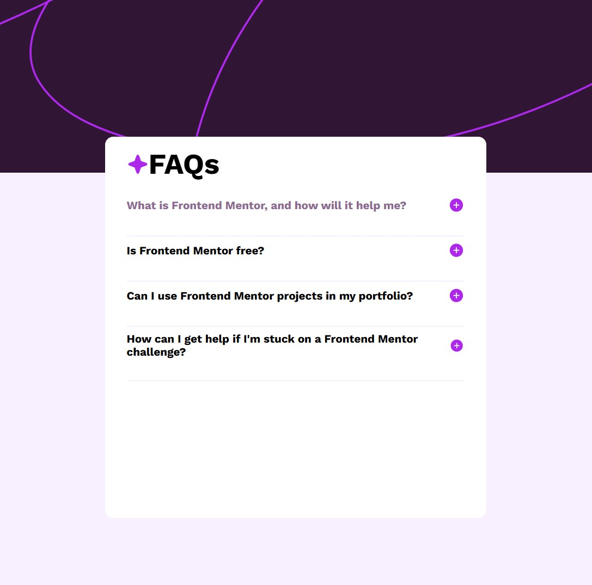

# Frontend Mentor - FAQ accordion solution

This is a solution to the [FAQ accordion challenge on Frontend Mentor](https://www.frontendmentor.io/challenges/faq-accordion-wyfFdeBwBz). 

## Table of contents

- [Overview](#overview)
  - [The challenge](#the-challenge)
  - [Screenshot](#screenshot)
  - [Links](#links)
- [My process](#my-process)
  - [Built with](#built-with)
  - [What I learned](#what-i-learned)
  - [Continued development](#continued-development)
- [Author](#author)

## Overview

### The challenge

Users should be able to:

- Hide/Show the answer to a question when the question is clicked
- Navigate the questions and hide/show answers using keyboard navigation alone
- View the optimal layout for the interface depending on their device's screen size
- See hover and focus states for all interactive elements on the page

### Screenshot

### Links

- Live Site URL: (https://ad-may.github.io/faq-accordion-main/)

## My process

- Building out the HTML for the application, keeping in mind tag optimization
- Creating styles with SASS as well as mixins for tooling
- Creating the logic for the FAQ
- Adding screen responsiveness
- Updating the UI to handle tab/enter navigation for further accessibility

### Built with

- Semantic HTML5 markup
- CSS custom properties
- Flexbox
- Mobile-first workflow
- [GoogleFonts](https://fonts.google.com/)
- [SASS](https://sass-lang.com/)

### What I learned

I learned more about DOM traversal, something I had to dust off in my memory banks. Furthermore, this is my first project
using SASS and I learned more about mixins and how they can simplify my workflow. To add to this, I now know how to add a tabbing functionality to my HTML elements with the `tabindex` property.

### Continued development

Further features I would like to add are:

- More elegant formatting for each dropdown element
- Even more screen-sizing accessibility

## Author

- Linkedin - [Alexander May](https://www.linkedin.com/in/alexander-may-6148a3242/)
- Frontend Mentor - [AD-May](https://www.frontendmentor.io/profile/AD-May)
